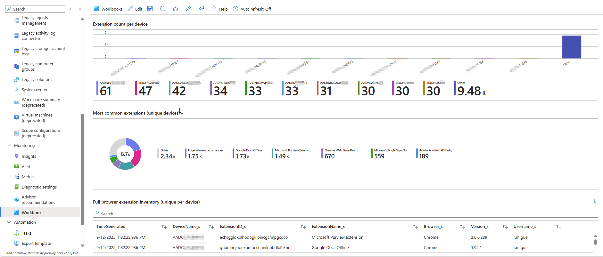

# Collect Browser Extension Inventory Solution

---

> **Disclaimer: Use at your own risk!**
>
> This script and documentation are provided as-is, without warranty of any kind. You are responsible for testing, validating, and securing this solution in your environment. The author is not liable for any damages, data loss, or costs incurred from use of this solution. Always review and adapt scripts to your organization's security and compliance requirements.

---

## Overview

This solution provides a PowerShell script to collect browser extension inventory from Windows devices and upload the data to an Azure Log Analytics Workspace. It is ideal for IT administrators who want to monitor browser extension usage across their environment, using Azure for centralized reporting and analytics.

---

## Features

- Collects extension data from major browsers (Chrome, Edge, Firefox)
- Deduplicates extension records per device/profile
- Converts extension data to JSON
- Uploads data securely to Azure Log Analytics using the HTTP Data Collector API
- Customizable log type and workspace configuration
- Can be deployed via Intune as a detection script or as a scheduled script

---

## Cost and Security Considerations

### Cost Estimate Example

Uploading data to Azure Log Analytics may incur costs based on the volume of data ingested and retained. As of 2025, typical pricing is around $2.76 per GB ingested (check the [Azure Monitor pricing page](https://azure.microsoft.com/en-us/pricing/details/monitor/) for your region and up-to-date rates).

**Example:**
- If each device uploads 10 KB of extension inventory data per run, and you have 1,000 devices reporting once per day:
  - Daily data: 10 KB x 1,000 = 10,000 KB = ~10 MB
  - Monthly data: 10 MB x 30 = 300 MB
  - Monthly cost: 0.3 GB x $2.76 ≈ $0.83

> **Note:** Actual costs depend on your data volume, retention settings, and region. Use the Azure Pricing Calculator for a more precise estimate.

### Security Considerations

Uploading data to Azure Log Analytics using the HTTP Data Collector API is secure when following best practices:

- **Data Transmission:**  All data is sent over HTTPS, ensuring encryption in transit.
- **Authentication:**  The script uses your Log Analytics Workspace ID and Primary Key for authentication.  **Important:** The Workspace Primary Key is sensitive—anyone with it can upload data to your workspace.
- **Data Scope:**  The script uploads only browser extension inventory, not passwords or highly sensitive user data.

#### Recommendations

- **Never share or publish your Workspace Primary Key.**
- **Store secrets securely** (e.g., Azure Key Vault, environment variables, or a secure vault).
- **Rotate your Workspace Key** regularly in the Azure Portal.
- **Restrict script access** to trusted admins or automation accounts.
- **Monitor your Log Analytics workspace** for unexpected data or usage.

> The upload process itself is secure, but protecting your Workspace Primary Key is critical. For even stronger security, consider using managed identities or Azure automation with secure credential storage.

---

## Prerequisites

- PowerShell 5.1 or later
- Access to an Azure Log Analytics Workspace
- Workspace ID and Primary Key (for API authentication)
- Sufficient permissions to run scripts and access browser extension data
- For Intune: Devices must be Azure AD joined/hybrid joined and Intune managed

---

## Setup Guide

### 1. Prepare Azure Log Analytics Workspace

- Create a Log Analytics Workspace in the Azure Portal if you do not already have one.
- To get your **Workspace ID** and **Primary Key**:
  1. In the Azure Portal, go to your Log Analytics Workspace.
  2. In the left menu, scroll down to the **Agents** section.
  3. Here you will find the **Workspace ID** and **Primary Key** (sometimes called "Primary Shared Key").
- Copy these values for use in the script configuration.

### 2. Configure the Script

- Download or copy the script to your management workstation or repository.
- Open the script in a text editor.
- Set your Workspace ID and Primary Key:
  ```powershell
  $WorkspaceId = "<Your-Workspace-ID>"
  $PrimaryKey = "<Your-Primary-Key>"
  $LogType = "BrowserExtensionsInventory"
  ```

### 3. Deploy with Intune

#### Option 1: As an Intune Script (One-Time or Scheduled)

1. In the Intune portal, go to **Devices > Scripts**.
2. Add a new PowerShell script.
3. Upload `collect-browserextentions2.ps1`.
4. Assign to your target device or user group.
5. Configure to run once or on a schedule (using Intune's scheduling options).

#### Option 2: As an Intune Detection Script

1. In the Intune portal, go to **Apps > Windows > [Your App] > Properties > Detection rules**.
2. Choose "Use a custom detection script".
3. Upload `collect-browserextentions2.ps1`.
4. (Optional) Modify the script to output a specific value or exit code if a certain extension is found/not found for compliance scenarios.

---

## How It Works

1. **Configuration**  
   Set your Log Analytics Workspace ID and Primary Key at the top of the script:
   ```powershell
   $WorkspaceId = "<Your-Workspace-ID>" # Log Analytics Workspace ID (GUID)
   $PrimaryKey = "<Your-Primary-Key>"   # Log Analytics Workspace Primary Key
   $LogType = "BrowserExtensionsInventory" # Custom log name
   ```
2. **Signature Generation**  
   The script builds the required authorization signature for the Log Analytics API.
3. **Data Collection**  
   The `Collect-BrowserExtensions` function scans the system for installed browser extensions, gathering details such as Device Name, Profile, Extension ID, Extension Name, Version, and Browser.
4. **Deduplication**  
   The script sorts and deduplicates the extension data to ensure only unique records are sent.
5. **Data Conversion**  
   The deduplicated data is converted to JSON format for compatibility with Log Analytics.
6. **Data Upload**  
   The `Post-LogAnalyticsData` function sends the JSON payload to Azure Log Analytics using the HTTP Data Collector API.
7. **Logging and Error Handling**  
   The script outputs status messages and errors to the console for troubleshooting.

---

## Using the Collected Data

### Azure Log Analytics

- The data is available in your workspace under the custom log name you specified (default: `BrowserExtensionsInventory_CL`).

#### Example KQL Queries

- **Show All Records**
  ```kusto
  BrowserExtensionsInventory_CL
  | project DeviceName, Profile, ExtensionID, ExtensionName, Version, Browser
  ```
- **Count Extensions by Browser**
  ```kusto
  BrowserExtensionsInventory_CL
  | summarize Count = count() by Browser_s
  ```
- **Find Devices with a Specific Extension**
  ```kusto
  BrowserExtensionsInventory_CL
  | where ExtensionName_s == "Adblock Plus"
  | project DeviceName, Profile, Version, Browser
  ```
- **List All Unique Extensions**
  ```kusto
  BrowserExtensionsInventory_CL
  | summarize by ExtensionID_s, ExtensionName_s, Browser_s
  ```
- **Count Extensions per Device**
  ```kusto
  BrowserExtensionsInventory_CL
  | summarize ExtensionCount = count() by DeviceName_s
  ```

---

## Creating a Workbook in Azure

1. **Go to your Log Analytics Workspace in the Azure Portal.**
2. Click on **Workbooks** in the left menu.
3. Click **+ New** to create a new workbook.
4. Add a query tile and use your KQL queries (see above) to visualize extension data.
5. Add visualizations (tables, pie charts, bar charts) as needed.
6. Save and share your workbook for ongoing monitoring.

### Example: Add a Pie Chart for Extensions by Browser

- Add a query:
  ```kusto
  BrowserExtensionsInventory_CL
  | summarize Count = count() by Browser_s
  ```
- Click "Visualization" and select "Pie chart".

---

## Editing a Workbook in Azure

To customize or edit your workbook for browser extension inventory in Azure Log Analytics:

1. **Open Azure Portal** and navigate to your Log Analytics Workspace.
2. In the left menu, click **Workbooks**.
3. Select your existing workbook (or create a new one as described above).
4. To edit a query:
    - Click on the query tile you want to modify.
    - Edit the KQL query in the editor pane.
    - Click **Run Query** to preview results.
5. To add a new visualization:
    - Click **Add** > **Add query**.
    - Enter your KQL query (see examples above).
    - Choose a visualization type (Table, Pie chart, Bar chart, etc.).
    - Configure visualization settings as needed.
6. To rearrange or remove tiles:
    - Use the drag handles to move tiles.
    - Click the ellipsis (...) on a tile to remove or duplicate it.
7. Click **Save** to keep your changes. You can also **Save As** to create a new version.
8. Optionally, share the workbook with others in your organization by clicking **Share**.

**Tip:** You can combine multiple queries and visualizations in a single workbook for a comprehensive dashboard of browser extension inventory across your devices.

---

## Example Output

```json
[
  {
    "DeviceName": "DESKTOP-1234",
    "Profile": "Default",
    "ExtensionID": "abcd1234",
    "ExtensionName": "Adblock Plus",
    "Version": "3.12.2",
    "Browser": "Chrome"
  }
]
```

---

## Screenshots

### 1. Script Execution

![Script running in PowerShell]
()

### 2. Data in Log Analytics

![Log Analytics Query Result]
()


### 3. Example Extension Data




---

## Customization

- **Log Type:**  Change `$LogType` to use a different custom log name in Log Analytics.
- **TimeStampField:**  Set `$TimeStampField` if you want to specify a custom time field in your log records.
- **Detection Logic:**  Modify the script to output a specific value or exit code for Intune detection/compliance scenarios.

---

## Troubleshooting

- **No data in Log Analytics:**
  - Check that your Workspace ID and Key are correct.
  - Ensure the device has internet access.
  - Review PowerShell output for errors.
- **Script errors:**
  - Run PowerShell as Administrator.
  - Ensure browsers are installed and profiles are accessible.

---

## References

- [Azure Monitor HTTP Data Collector API](https://docs.microsoft.com/en-us/azure/azure-monitor/logs/data-collector-api)
- [Log Analytics Custom Logs](https://docs.microsoft.com/en-us/azure/azure-monitor/logs/custom-logs)
- [KQL Quick Reference](https://learn.microsoft.com/en-us/azure/data-explorer/kusto/query/)
- [Log Analytics Workbooks](https://learn.microsoft.com/en-us/azure/azure-monitor/visualize/workbooks-overview)
- [Deploy PowerShell scripts using Intune](https://learn.microsoft.com/en-us/mem/intune/apps/intune-management-extension)

---

## Author

Manuel Jong

---

## Using Browser Extension Inventory JSON in Azure Workbooks

To visualize or analyze browser extension inventory in Azure, you can import your JSON data directly into an Azure Workbook using the Advanced Editor. This approach is ideal for demos, documentation, or sharing sample data in a workbook format.

### How to Import JSON Data into an Azure Workbook (Advanced Editor)

1. **Open Azure Portal** and navigate to your Log Analytics Workspace.
2. In the left menu, click **Workbooks**.
3. Click **+ New** to create a new workbook, or select an existing one to edit.
4. In the workbook, click the **Advanced Editor** (usually found in the toolbar or under the "..." menu).
5. In the Advanced Editor, locate the section for data sources or queries.
6. Add a new data source of type **JSON** (or locate the JSON data block if editing an existing workbook).
7. Copy the entire contents of your browser extension inventory JSON file and paste it into the JSON data block in the editor.
8. Save or apply your changes in the Advanced Editor.
9. Use the workbook designer to add visualizations (tables, charts, etc.) based on the imported data fields (such as DeviceName, Profile, ExtensionID, ExtensionName, Version, Browser).
10. Save your workbook for future use or sharing.

#### Example Use Cases

- Demo or test workbook visualizations with sample data before deploying organization-wide.
- Import historical or offline inventory data for analysis in Azure Workbooks.
- Share a workbook template with preloaded JSON data for training or documentation.

**Note:** For live, automated reporting, uploading data to Azure Log Analytics and connecting the workbook to the Log Analytics table is recommended. Using the JSON file via the Advanced Editor is best for manual import, demos, or offline scenarios.
